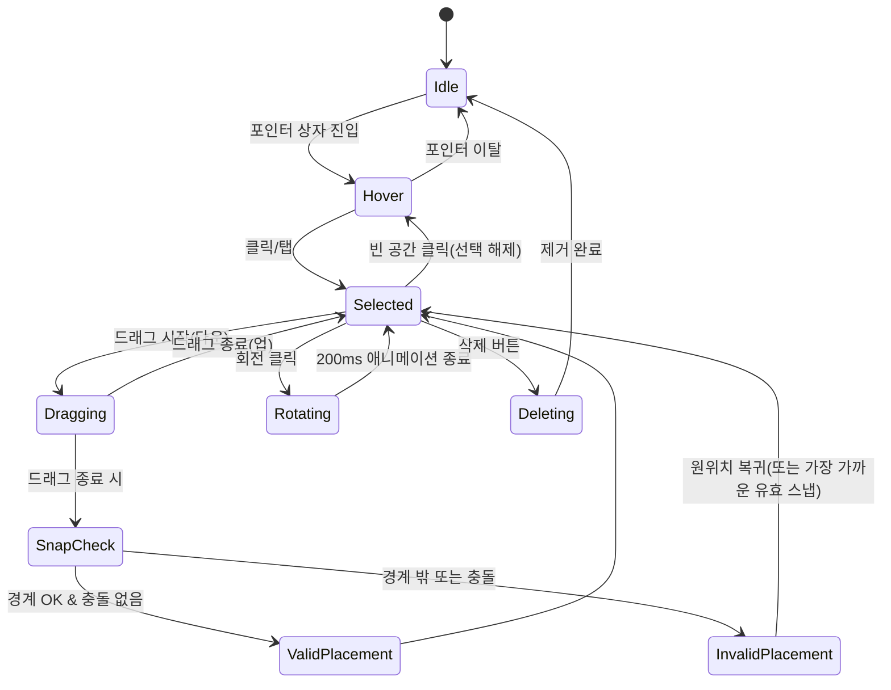
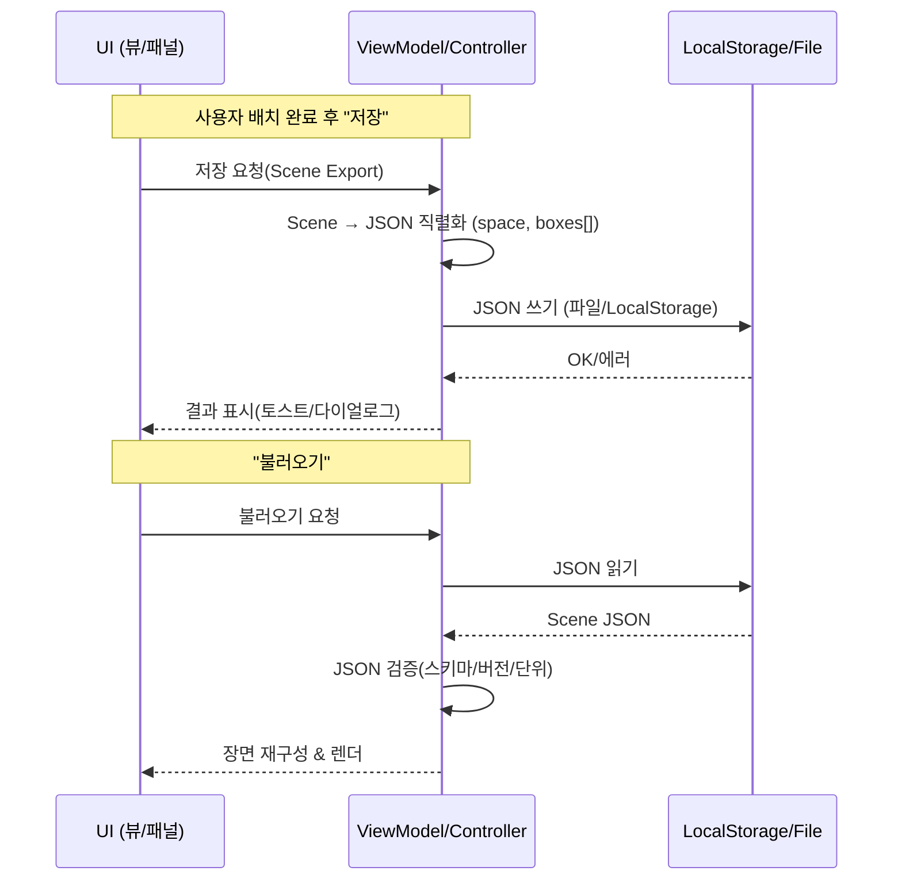

# TrunkBox Simulator – UI & Flow

## 1) 화면/네비게이션 플로우 (Mermaid)

```mermaid
flowchart LR
    A[앱 시작] --> B[홈/대시보드]
    B --> C[아이소메트릭 트렁크 뷰]
    C <-->|토글| D[평면도(2D) 뷰]

    C --> E[+ 박스 추가 모달]
    E -->|확인| C
    E -->|취소| C

    C --> F[박스 선택 상태]
    F --> G[회전 90°]
    F --> H[삭제]
    F --> I[복제]

    C --> J[저장]
    C --> K[불러오기]
    C --> L[스크린샷]

    J --> C
    K --> C
    L --> C

    C --> M[설정/치수 입력]
    M --> C
```

## 2) 박스 조작 상태머신 (Drag/Rotate/Delete)



### 상태 규칙 요약

* **Dragging**: X–Z 평면 이동, y=0 고정(쌓기 도입 전)
* **SnapCheck**: grid(예: 10cm) 반올림 → 경계/충돌 검사
* **InvalidPlacement**: 빨간 테두리 + 토스트 “겹칩니다/경계 밖”
* **Rotating**: rotY= (0/90/180/270), w↔d 스왑 후 즉시 유효성 재검사

## 3) 저장/불러오기 데이터 플로우 (Sequence)



### JSON 스키마(리마인드)

```json
{
  "version": "1.0.0",
  "space": { "w": 1.08, "d": 1.07, "h": 0.12, "wheelhouse": { "left": { "w": 0.18, "h": 0.12, "d": 0.36 }, "right": { "w": 0.18, "h": 0.12, "d": 0.36 } } },
  "grid": 0.10,
  "boxes": [
    { "id": "box-001", "size": { "w": 0.45, "d": 0.35, "h": 0.30 }, "pos": { "x": 0.10, "y": 0.00, "z": 0.20 }, "rotY": 0, "label": "Camping A" }
  ]
}
```

* `space.h`는 “매트 시뮬레이터” 특성상 얕게(예: 0.12m) 설정
* `wheelhouse`는 바닥 레벨에 돌출된 영역(피해야 할 공간)로 모델링

## 4) 에러/피드백 정책

* **겹침/충돌**: 상자 테두리 `error` 컬러 + 토스트 “다른 상자와 겹칩니다”
* **경계 밖**: 상자 테두리 `error` 컬러 + 토스트 “경계 밖입니다”
* **불러오기 실패**: “지원하지 않는 버전/잘못된 JSON”
* **스크린샷 완료**: “갤러리에 저장됨 / 클립보드 복사됨”

## 5) 측정/지표 (Design QA용)

* 배치된 박스 수, 총 부피, **바닥 면적 점유율(%)**
* 휠하우스/금지영역 제외한 **유효 면적 대비 점유율**
* 평균 조작 시간(박스 생성→적정 배치까지)

## 6) 접근성 & 반응형

* 키보드: 방향키 미세 이동(그리드 단위), R=회전
* 색각 보정: 선택/오류 상태를 **색상+아이콘/패턴** 병행
* 모바일: 하단 패널(버튼/리스트), 데스크톱: 우측 패널

---

### 다음 단계 제안

1. 위 플로우대로 **Figma Prototype**에 인터랙션(오버레이/토글/애니메이션) 연결
2. **컴포넌트 라이브러리**(Button/Input/Card/Toast) 스타일을 토큰으로 묶기
3. 개발팀 핸드오프용으로 **컴포넌트 명세표**(속성, 이벤트) 1장 추가

